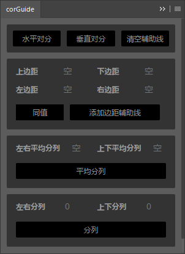
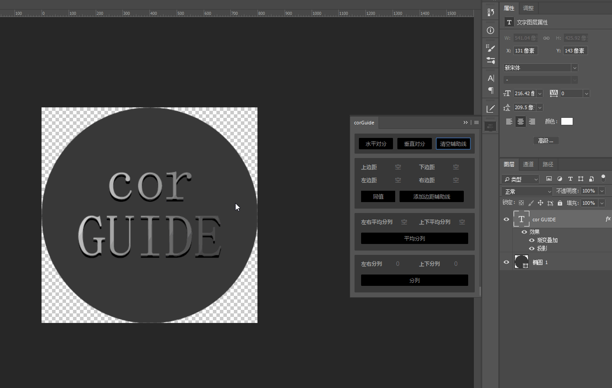
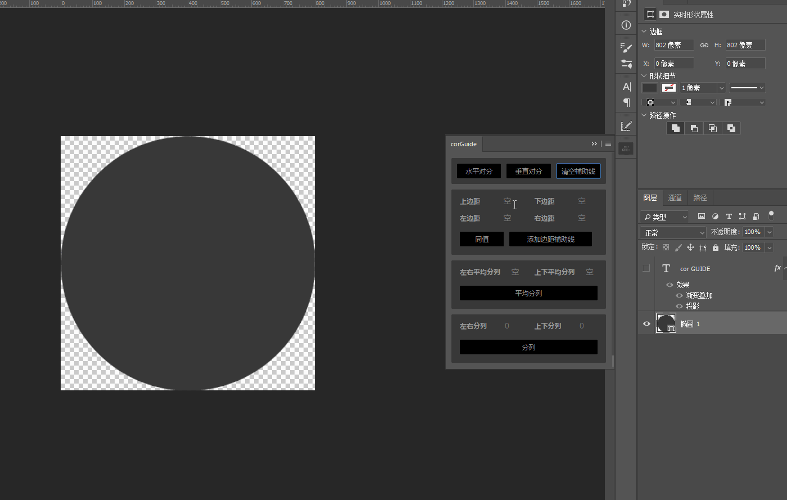
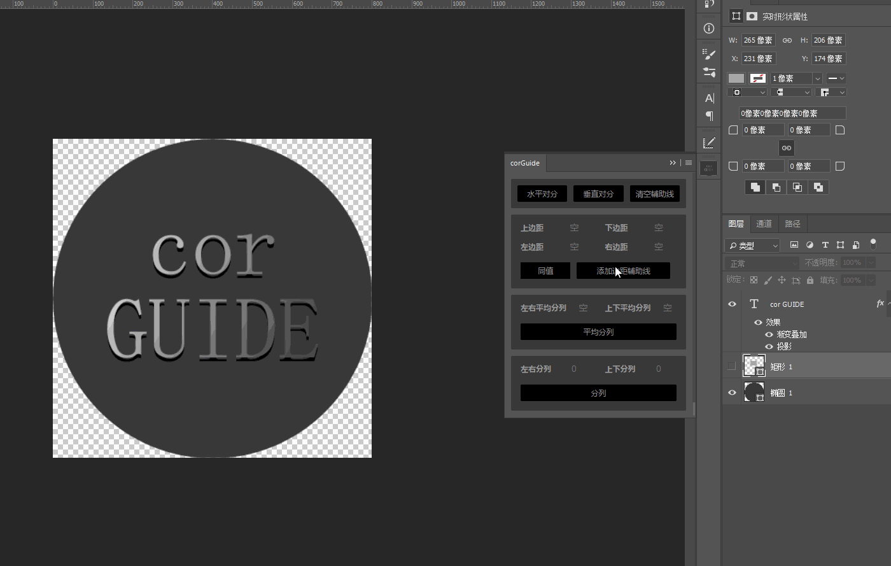

### corGuide 是一个photoshop 扩展程序（辅助线程序）

主要实现功能如下
### 1- 水平对分 垂直对分 清空辅助线

优先级别 选区>选中图层

### 2- 边距线 可以对图层或选区 创建内外辅助线

优先级别 选区>选中图层

### 3- 平均辅助线 

优先级别 选区>选中图层

### 4- 数值分列 

优先级别 选区>选中图层

<<<<<<< HEAD

安装教程 

打开到注册表（运行 regedit）：

CC 2015：HKEY_CURRENT_USER\Software\Adobe\CSXS.6

CC 2015.5：HKEY_CURRENT_USER\Software\Adobe\CSXS.7

添加 字符串值 项 PlayerDebugMode，将值设置为 1

window 64位 把文件(可以删除Screenshots文件夹)拷贝到  C:\Program Files (x86)\Common Files\Adobe\CEP\extensions
=======

>>>>>>> 25038e9170dda9f2daf53fc0bbf892236af6d08e
